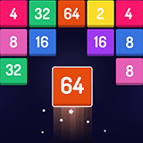
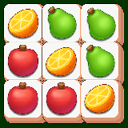

# GuoLingZhi Network (郭凌智网络)

  
  
  

Welcome to the official portal repository of **GuoLingZhi Network**, dedicated to creating engaging, relaxing, and enjoyable casual puzzle games for mobile players worldwide.

> 🌐 **Interactive Portal**: Visit our interactive online catalog with search and genre filtering at **[gkismet.github.io](https://gkismet.github.io/)**.

---

## 🌟 Featured Titles

| Icon | Game Title | Category | Download Links |
| :---: | :--- | :--- | :--- |
|  | **Merge Puzzle 2048** | Merge & Numbers | [Google Play](https://play.google.com/store/apps/details?id=com.x2blocks.puzzlegame.number.merge) &bull; [App Store](https://apps.apple.com/app/id1627699192) |
|  | **Mahjong-Puzzle Games** | Classic Match | [Google Play](https://play.google.com/store/apps/details?id=com.mahjong.free.puzzlegame) &bull; [App Store](https://apps.apple.com/app/1643478309) |
|  | **Puzzle Test Master** | Brain & Dice | [Google Play](https://play.google.com/store/apps/details?id=com.puzzledom.blockpuzzle.dice) &bull; [App Store](https://apps.apple.com/app/id1615961261) |
|  | **Avatar Maker-Comics** | Casual Dress Up | [Google Play](https://play.google.com/store/apps/details?id=dressup.vlinder.avatar.maker.comics) &bull; [App Store](https://apps.apple.com/app/6443975845) |
|  | **配对动物 (Match 3D)** | Match 3D Puzzle | [Google Play](https://play.google.com/store/apps/details?id=com.block.match3d.puzzlegame) &bull; [App Store](https://apps.apple.com/app/id1610846682) |
|  | **骰子大师 (Merge Puzzle)** | Dice Merge | [Google Play](https://play.google.com/store/apps/details?id=com.dicedom.dicemerge.puzzlegame) &bull; [App Store](https://apps.apple.com/app/id1592798941) |
|  | **火柴人排序 (Color Sort)** | Sort Puzzle | [Google Play](https://play.google.com/store/apps/details?id=color.sort.stickman.puzzlegame) &bull; [App Store](https://apps.apple.com/app/id1626688873) |
|  | **Tiles Link** | Tile Connect | [Google Play](https://play.google.com/store/apps/details?id=com.tile.Match.classic.empire) &bull; [App Store](https://apps.apple.com/app/id1627724752) |
|  | **Water Sort Color** | Water Pouring | [Google Play](https://play.google.com/store/apps/details?id=water.sort.puzzlegame.soda) &bull; [App Store](https://apps.apple.com/app/id1634198117) |
|  | **Merge Numbers-2048** | 2048 Puzzle | [Google Play](https://play.google.com/store/apps/details?id=com.games.block.puzzle2048.merge.number) &bull; [App Store](https://apps.apple.com/app/id1642451532) |

---

## 🎮 Game Matrix & Remote Configuration
This repository also serves as the static CDN server for our in-game cross-promotional matrix:
- **[cfg/more_game.json](cfg/more_game.json)**: Full JSON listing of 130+ game titles, package identifiers (`pkg_name`), game genres, and release versions.
- **[icon_ms/](icon_ms/)**: High-resolution game square icons matching configuration IDs (`{id}_s.png`).

---

## 📋 Legal & Compliance
- **[Privacy Policy](PrivacyPolicy.txt)**: Our standard user data protection and privacy policy.
- **[app-ads.txt](app-ads.txt)**: IAB Authorized Digital Sellers specification for mobile in-app ad verification.
- **[site-verification.txt](site-verification.txt)**: Domain verification token.

---

## 📬 Contact Us
For business partnerships, game publishing, or user feedback:
- **Email**: [classicgamepuzzle2020@gmail.com](mailto:classicgamepuzzle2020@gmail.com)
